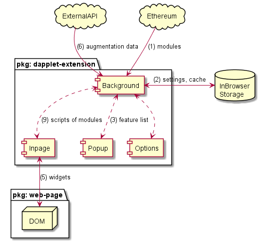
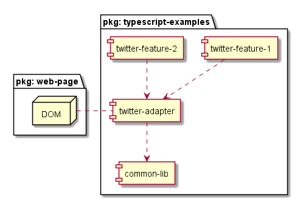

# Solution Architecture

## Glossary

**Dapplet Extension** -

**Background**-

**ContentScript**-

**Options** -

**Context** -

**Adapter** -

**Feature** -

**Insert point** -

**Widget** -

**Additional context** -

**Augmentation Server** -

## Dapplet Extension

The diagram below describes the structure of the extension and its external environment.

General scheme of work:

1. Background loads modules from decentralized storage.
2. Background caches modules in the browser's internal storage and reads the settings.
3. The user turns on the Features he needs, available for the current page, via Popup.
4. ContentScript, when loading the context page, receives the texts of module scripts from Background
5. ContentScript parses contextual information from the web page during the execution of modules and inserts buttons (widgets) into the page.
6. If necessary, additional data is supplied from an external API (for example, via WebSocket or HTTP) to expand the context.

## Injectable Modules

For the development of modules, an architecture is proposed that allows dividing functional responsibilities into separate modules:

- Adapter (adapter) - "low-level" interaction with the DOM of the page;
- Opportunity (feature) - "high-level" description of business cases.

The purpose of this separation is to simplify the development of widgets to implement business cases without having to dive down to the DOM level of a web page.

The Feature developer operates only on the high-level classes provided by the adapter, which encapsulate all the logic for interacting with the DOM of the web page.

A Feature developer can embed widgets on a web page without knowing how the DOM is structured. This allows you to fully focus on the implementation of business cases.

The tasks of adapter modules are:

1. Parsing contextual information from the DOM of a web page.
2. Determining the insertion points available on the web page.
3. Determining the types of widgets available for placement at each specific insertion point.
4. Embedding widgets in the DOM of a web page.
5. Watch for changes to the DOM of a web page.

The tasks of the capability modules are:

1. Widget configuration and binding to a specific insertion point.
2. Description of the behavior of widgets when interacting with them.
3. Configuration of the entry point to the external API for loading the augmented context.

### Dependencies between modules

The diagram below shows an example of what dependencies between modules might look like.

The `twitter-feature-1` and `twitter-feature-2` feature modules use the `twitter-adapter` adapter to inject widgets. The `twitter-adapter` module interacts with the DOM of a web page.

It is possible to use shared libraries to move repetitive code into separate modules. In the diagram, `twitter-adapter` uses the `common-lib` module.

Examples of such an implementation can be found in the [typescript-examples](https://github.com/dapplets/typescript-examples) repository.
